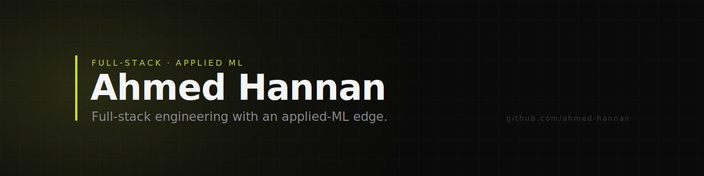

<!--
  Profile README for github.com/ahmed-hannan
  Accent color: #c5d642 (lime). To restyle, see SETUP.md → "Changing the accent".
-->

<picture>
  <source media="(prefers-color-scheme: dark)" srcset="./assets/header.svg">
  <source media="(prefers-color-scheme: light)" srcset="./assets/header-light.svg">
  
</picture>

 

I'm Ahmed. A little over a year in, I build across the web stack and machine
learning — and I've learned to ship fast without losing the details. I like
small, sharp interfaces and systems that hold up in production.

 

**Stack**

 

**Activity**

 

<picture>
  <source media="(prefers-color-scheme: dark)" srcset="https://raw.githubusercontent.com/ahmed-hannan/ahmed-hannan/output/snake-dark.svg">
  <source media="(prefers-color-scheme: light)" srcset="https://raw.githubusercontent.com/ahmed-hannan/ahmed-hannan/output/snake-light.svg">
  
</picture>

 

---

  <!-- Fill these in — see SETUP.md → "Footer links" -->
  <a href="mailto:you@example.com">Email</a> ·
  <a href="https://www.linkedin.com/in/your-handle">LinkedIn</a> ·
  <a href="https://your-site.dev">Website</a>

